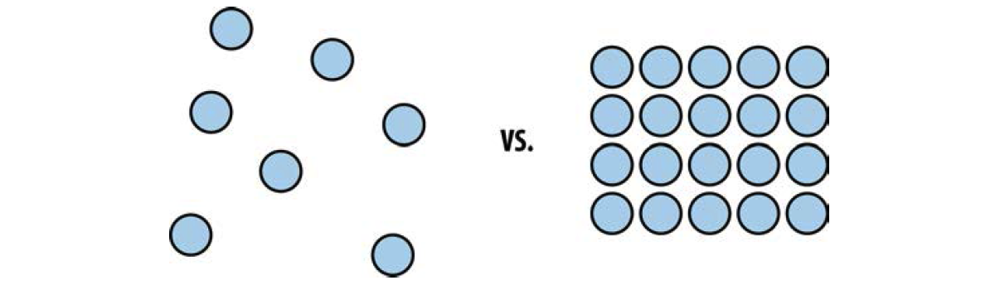

## Design principles

Design Principles are the language and the environment of expressing what is right and wrong in designs. It expresses a state so that the user has the best experience at handling the design. In Web Design, there is everything about usability. The main focus of web design is to achieve a visitor with a long lasting attention. The user should be interested in the topics and should get the information straight forward, without clicking through unpredictable dialogues or sections. These principles are the rule sets and the scientific laws of the usability, like the gravity law on earth. They were crafted during a long period of studying humans‘ behaviour and understanding the environment. That is the reason why you should design for the people and not for the aesthetics.

> “People ignore design that ignores people.”
> 
> Chimero, Frank: Frank Chimero on losing control of creative works – https://dcurt.is/frank-chimero-on-losing-control, 20.03.2017

### The principle of proximity

The principle of proximity is based on the perception of the distance between objects. Simplified its references to the grouping principle. Two objects, that are closer together pretend to have a relationship. In comparison, two objects that are further apart would have less relation. In general, it is a pattern system, that describes a function. Ordering objects according to each other based on the function lead to a comprehensible layout and design. With this little enhancement, it is possible to generate a huge impact in improving the design. Think about frustrated and confused users, who are not able to get any kind of information in case of a misleading arrangement of objects and how they are organised. The solution is a clear and well-considered layout that puts less strain on users to find the information they need.
> cf. Lowdermilk, Travis: User-Centered Design. (First Release) – 1005 Gravenstein Highway North, Sebastopol, CA 95472: O’Reilly Media, Inc., 2013, p. 63 – 64

Example of the proximity principle

### Visibility, visual feedback and visual prominence

Taking a deeper look at visibility it is all about setting focus on certain elements when an event is triggered or an element should be highlighted. The focus can be achieved with modifying the Typeface, in different styles font weights. Furthermore, a common tool is the opacity to adjust the visual prominence, like adjusting the size of the elements. Obviously large elements on the page achieving more focus than smaller elements. The last important part is the status, that indicates all the browser states for interactions like mouse over or mouse out, click or focus. To indicate these states often micro animations are used to give them a piece of importance. The main focus of the visibility principle is to provide a clear and simple user experience so that the application or website is responding to the user`s input.
> cf. Lowdermilk, User-Centered Design, p. 65 – 67

### Irreducible Simplicity

Starting to create a design is always a process where the designer wants to pack everything that was documented before in a brainstorming or in several meetings, inside the design. Every idea should take place in the design to enhance the functionality and create the fanciest and latest design ever. Probably this is the wrong way to achieve this goal. Steve Jobs said once the following quote.

> “Deciding what not to do is as important as deciding what to do.”
>
> Jobs, Steve: The Real Leadership Lessons of Steve Jobs – https://hbr.org/2012/04/the-real-leadership-lessons-of-steve-jobs, 20.03.2017

Concerning the following, it is not accomplished while reducing everything to the clear white HTML Markup without any CSS or additional styling. Satisfaction is important to enhance the experience of using the site and should not be sacrificed. Furthermore, it is important to lead the user through an experience of satisfying moments to gain returning visitors. This principle only claims, that sometimes less features were more features. Some simple animations are sometimes better than a bunch of flying objects on the page – keep in mind that the duty of a communication designer is to solve problems with the design not to create problems through feature richness.
> cf. Schools, David: Design Principles To Evaluate Your Product – https://www.smashingmagazine.com/2015/12/design-principles-to-evaluate-your-product/, 20.03.2017

### Approachable Innovation

Last but not least the success of a good design is always a balance between innovation that is boring and an innovation that scares the people. The centre is the approachable innovation that should be used. Often designers are able to think out of the borders but the end-user might not have this ability that is the point where it is important to find a compromise that everybody is understanding. Keeping in mind that the main goal is to achieve a good user experience in solving problems.
> cf. Schools, David: Design Principles To Evaluate Your Product – https://www.smashingmagazine.com/2015/12/design-principles-to-evaluate-your-product/, 20.03.2017