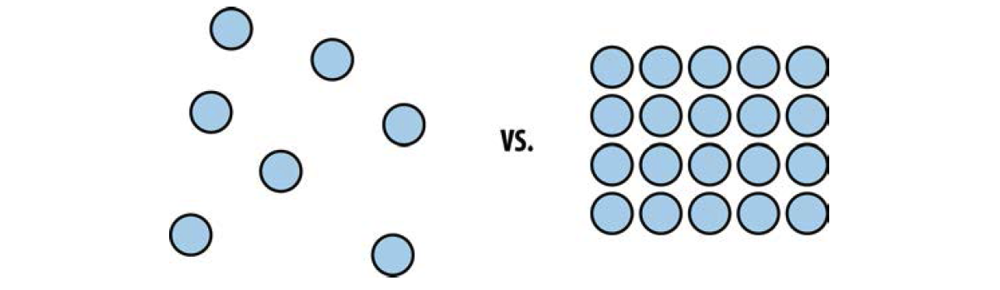

# UI and UX design

The Acronyms UI and UX are quite common in modern web discussions – is is like the basic scaffolding of a modern webpage or webapp. These Acronyms representing the words *User Interface* and *User Experience Design*.

## User Experience Design

But What is UX? If you hear the word User Experience Design you probably think about arranging objects or designing colors and graphics on the screen. But User Exprience is quite different. It is more about the experience of using things. The aim is to find the easierst way of communication which is intuitiv and simple. But getting on the right lane is a long progress in getting in touch with people. Knowing the target customers is the responsibility in UX design. It is important to know their habbits and reactions, to face their problems. Design is not about arranging things in an asthetical way. It is a progress of solving problems. We are all facing problems everywhere and for the most cases there might be a solution out there. But life is not a pre written script. It is unpredictable. There are so many edge cases out there and the goal of a good UX design is to solve as many problems as possible.

> see http://uxmag.com/articles/explaining-ux-design-to-your-team
> see http://blog.careerfoundry.com/ux-design/the-ux-design-process-an-actionable-guide-to-your-first-job-in-ux

> see Levin, Michal: Designing Multi-Device Experiences – An Ecosystem Approach To User Experiences Across Devices. (First release): O'Reilly and Associates, 2014, S. 20 – 

## User Interface Design

When we are talking about User Interaface Design, it is not a conversation about subjective art. On the contrary it is an objective principled form of human conversation and behavior. It is like Steve Jobs said: “Design is not just what it looks like and feels like. Design is how it works” (Steve Jobs). But in spite of this User Interface is based on a good UX design. These two Principles are connected to each other. It is like an environment

> Vimeo Krishna, Golden – The Best Interface is No Interface: https://vimeo.com/48629451
> Krishna, Golden (2016). The Best Interface is No Interface. In: SlideShare. [online] City: Golden Krishnas presentation at From Business to Buttons in Stockholm. Available at: https://de.slideshare.net/inusese/golden-krishna-the-best-interface-is-no-interface

> McKay, Everett. (2014). Ui is Communication: How to design intuitive, user-centered interfaces by focusing on effective communication. In: SlideShare. [online]. Available at: ttps://de.slideshare.net/EverettMcKay/ui-is-communication-how-to-design-intuitive-usercentered-interfaces-by-focusing-on-effective-communication [10.03.2017].

## Design Principles

Design Principles are the language and the environment of expressing what is right and wrong in designs. It expresses a state so that the user has the best experience at handling the design. In Web Design there is everything about usability. The main focus of web design is to archive a visitor with a long lasting attention. The user should be interested in the topics and should get the information straight forward, without clicking throught unpredictable dialogs or sections. These principles are the ruleset and the scientific laws of the usability, like the gravity law on earth. They were craftet during a long period of studying humans' behavior and understanding the environment. That is the reason why you should design for the people and not for the asthetics.

> “People ignore design that ignores people.”
> – Frank Chimero

### The Principle of Proximity

The principle of proximity is based on the perception of the distance between objects. Simplified it referres to the grouping principle. Two objects, that are closer together pretend to have a relationship. In comparison two objects, that are further apart, would have less relation. In general it is a pattern system, that describse a function. Ordering objects according to each other based on the function leads to a comprehensible layout and design. With this little enhancement it is possible to generate a huge impact in improving the design. Think about frustrated and confused users, which are not able to get any kind of information, in case of missleading arrangement of objects and how they are organized. The solution is a clear and well-considered layout that puts less strain on users to find the information, they need.

> see Lowdermilk, Travis: User-Centered Design. (First release) – 1005 Gravenstein Highway North, Sebastopol, CA 95472: O’Reilly Media, Inc., 2013, S. 63 – 64

Example of the proximity principle

### Visual Feedback and Visual Prominence

### unreduzierbare Einfachheit
> “Deciding what not to do is as important as deciding what to do.”
> – Steve Jobs

### Intuition

### Funktionalität vor Ästhetik

### Innovation
Der Erfolg von Innovation ist wie eine Schaukel zwischen Langeweile (nichts neues) und Argwohn (zu viel neues)

### Form and Colorcomposition

### Repeatable patterns

> see https://www.smashingmagazine.com/2015/12/design-principles-to-evaluate-your-product/

## The relation of impact and effort

> see https://www.smashingmagazine.com/2016/10/giving-your-product-a-soul/)

## Googles Material Design principle

### The minimalistic approach

## The thumb zone – Mobile Design

> see https://www.smashingmagazine.com/2016/09/the-thumb-zone-designing-for-mobile-users/
